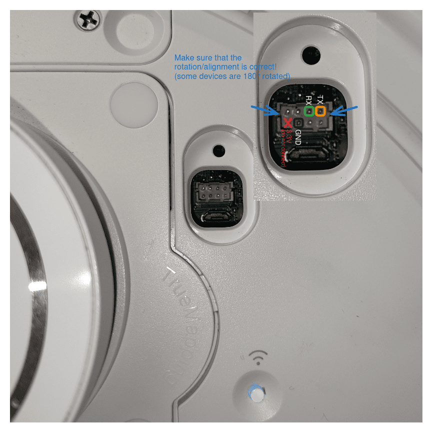

# Certificate Unpinning on Ecovacs Bot

> **⚠️ Disclaimer:**
>
> Accessing and modifying your Ecovacs bot is risky and may permanently damage your device. These steps will void your warranty, may violate your terms of service, and Ecovacs will likely refuse support for modified devices. Proceed entirely at your own risk!
>
> > Double check all params. This instruction was tested on bot `T10 PLUS`. If you have another model, details may differ.

This guide explains two approaches to enable your Ecovacs bot to trust a self-signed certificate for use with a self-hosted Bumper server:

-   **Option 1 (Recommended, Safer):** Replace certificate files on the bot—no firmware modification required.
-   **Option 2 (Advanced):** Extract, modify, and reflash the root filesystem for deeper changes.

---

## 🟢 Option 1: Simple Certificate Replacement

This method only updates certificate files on the bot. No firmware unpacking or flashing is needed.

### 1. Start UART Console (on host)

Connect to the bot's UART serial port:

> Adjust parameters as needed:
>
> -   `/dev/ttyACM0`: your device may differ
> -   `--log ...`: optional, remove if you don't want logs

```sh
picocom /dev/ttyACM0 --flow n --baud 115200 --log ./b-capture-"$(date --iso-8601=seconds)".log
```

| UART - T10 PLUS                                                        | UART - [EXT-SOURCE](https://dontvacuum.me/talks/DEFCON32/DEFCON32_reveng_hacking_ecovacs_robots.pdf) |
| :--------------------------------------------------------------------- | :--------------------------------------------------------------------------------------------------- |
| { width="300" } | { width="300" }                           |

### 2. Interrupt Boot and Enter Shell (on bot)

On startup, interrupt into `Hobot` (press any key), then boot with updated `bootargs`:

```sh
setenv bootargs ${bootargs} init=/bin/bash
boot
```

??? note

    On some bots you need to hit a specific key mention during the bootup process like:
    ```
    Hit key to stop autoboot('CTRL+C'):  0 
    ```
    
    Sometime `picocom` is not working and in that case you can try `minicom`. You can keep pressed your key (eg. 'CTRL+C') during the boot process until it's interropted.
    ``` sh
    minicom -D /dev/ttyUSB0 -b 115200
    ```

### 3. Initialize System Resources (on bot)

Mount volumes and start required services:

```sh
export TERM=xterm-256color
mount -a

/etc/rc.d/pre_boot.sh start
/etc/rc.d/mount_data.sh start
/etc/rc.d/post_boot.sh start
/etc/rc.d/load_ko.sh start
/etc/rc.d/time_sync.sh start
```

??? note

    On some models executing the above commands are failing. In this case you can try to manually mount `data` by checking the boot logs for the correct partition. During the bootup the partition table is logged on the console and looks similar to:
    ```
    GPT part:  0, name:            uboot, start:0x4000, size:0x2000
    GPT part:  1, name:            trust, start:0x6000, size:0x2000
    GPT part:  2, name:              eco, start:0x8000, size:0x3000
    GPT part:  3, name:          reserve, start:0xb000, size:0x800
    GPT part:  4, name:              sys, start:0xb800, size:0x1000
    GPT part:  5, name:            boot1, start:0xc800, size:0x3000
    GPT part:  6, name:          rootfs1, start:0xf800, size:0x40000
    GPT part:  7, name:            boot2, start:0x4f800, size:0x3000
    GPT part:  8, name:          rootfs2, start:0x52800, size:0x40000
    GPT part:  9, name:             data, start:0x92800, size:0x5b7df
    ```

    Identify the data partition (in the above example it's on index 9) and add 1 to it and check if you have a device by `ls /dev/rkflash0pX` (in the above example `/dev/rkflash0p10`)

    If the device exists, you can manually mount it with
    ``` sh
    mkdir -p /data
    fsck.ext4 -y /dev/rkflash0p10
    mount -t ext4 -o rw /dev/rkflash0p10 /data
    ```

### 4. Replace Certificates (on bot)

> **ℹ️ Note:**
> Certificate changes made in this step may be reverted by a factory reset or firmware update. It is recommended to first connect your bot to the official Ecovacs cloud and complete the initial setup before replacing the certificates. If you ever reset or update the bot, you will need to repeat these certificate replacement steps.

After running the above scripts, `/data` is mounted. You now need to manually update the certificate files on the bot using the UART shell:

-   On your host, open the following files in a text editor:
    -   `./certs/ca.crt`
    -   `./certs/bumper.crt`
-   On the bot (UART shell), use an editor like `vi` or `cat >` to paste the contents into the correct files:
    -   Overwrite `/data/ca.crt` with the contents of `./certs/ca.crt`
    -   Overwrite `/data/ca-certificates/ca.pem` with the contents of `./certs/ca.crt`
    -   For `/data/ca-certificates/ca-certificates.crt`, append the contents of `./certs/bumper.crt` and then `./certs/ca.crt` to the end of the file (do not remove existing entries; just add these two certs at the end, in this order)

> Tip: You can use `vi /data/ca-certificates/ca-certificates.crt` and paste at the end, or use `cat >> /data/ca-certificates/ca-certificates.crt` to append. Make sure to save and exit after pasting.

Your bot should now trust your self-signed certificates. Reboot and test connectivity to your Bumper server.

---

## 🟡 Option 2: Full Root Filesystem Modification (Advanced)

> **⚠️ Not Ready:**
> This section is incomplete and not fully tested. Proceed only if you know what you are doing. More research/reverse engineering is required, especially for step `4. Flash Modified Rootfs Back to Bot -> b. Download and Flash on Bot`.

If the simple method does not work, you may need to modify the root filesystem. This is riskier and can brick your device if done incorrectly.

### 1. (Optional) Setup WiFi (on bot)

If you need network access on the bot, set up WiFi:

#### a. Load WiFi Firmware

```sh
/etc/rc.d/wifi.sh start
```

#### b. Connect to WiFi

> Replace placeholders with your actual values:
>
> -   `<YOUR_SSID>`
> -   `<YOUR_WIFI_PASSWORD>`
> -   `<YOUR_BOT_IP>` (e.g., 192.168.112.57)
> -   `<YOUR_GATEWAY_IP>` (e.g., 192.168.112.1)

```sh
mkdir -p /tmp/wpa_ctrl
echo "ctrl_interface=/tmp/wpa_ctrl" > /tmp/wpa_supplicant.conf

wpa_passphrase '<YOUR_SSID>' '<YOUR_WIFI_PASSWORD>' >> /tmp/wpa_supplicant.conf

wpa_supplicant -B -i wlan0 -c /tmp/wpa_supplicant.conf -f /tmp/wpa.log -s
ifconfig wlan0 '<YOUR_BOT_IP>' netmask 255.255.255.0 up
route add default gw '<YOUR_GATEWAY_IP>'
```

### 2. Create Root Filesystem Dump (on bot)

#### a. Dump Root Filesystem

```sh
dd if=/dev/ubi0_0 of=/tmp/rootfs.img bs=1M
```

#### b. (Optional) Backup Other Partitions

```sh
dd if=/dev/ubi1_0 of=/tmp/data.img bs=1M
dd if=/dev/ubi2_0 of=/tmp/sysinfo.img bs=1M
dd if=/dev/ubi3_0 of=/tmp/ai_model.img bs=1M
tar -czf /tmp/data.tar.gz -C /data .
```

#### c. Serve Files for Download

```sh
cd / && httpd -p 8080
```

### 3. Download and Extract Root Filesystem Dump (on host)

#### a. Download Root Filesystem to Host

> Replace `<YOUR_BOT_IP>` with your bot's actual IP address.

```sh
curl -Lo rootfs.img http://<YOUR_BOT_IP>:8080/tmp/rootfs.img
```

#### b. (Optional) Download Other Partitions to Host

```sh
curl -Lo data.img http://<YOUR_BOT_IP>:8080/tmp/data.img
curl -Lo sysinfo.img http://<YOUR_BOT_IP>:8080/tmp/sysinfo.img
curl -Lo ai_model.img http://<YOUR_BOT_IP>:8080/tmp/ai_model.img
curl -Lo data.tar.gz http://<YOUR_BOT_IP>:8080/tmp/data.tar.gz
```

You can extract or inspect these optional backup partitions with tools like `ubireader_extract_files`, `strings`, or `unsquashfs`:

```sh
ubireader_extract_files data.img
cat sysinfo.img | strings
unsquashfs -d ai_model ./ai_model.img
mkdir -p data && tar -xzf ./data.tar.gz -C data
```

#### c. Extract and Modify Rootfs

```sh
unsquashfs -d rootfs ./rootfs.img
# ... edit rootfs as needed ...
mksquashfs rootfs rootfs_mod.img -noappend -root-owned -p '/dev d 755 0 0' -p '/dev/console c 600 0 0 5 1'
```

### 4. Flash Modified Rootfs Back to Bot

#### a. Start HTTP Server on Host

```sh
python3 -m http.server 8080
```

#### b. Download and Flash on Bot

> **⚠️ Not Ready:**
> This step is not finished. When starting into `boot_mode2`, the root password is required. Further reverse engineering is needed.

> Replace `<YOUR_HOST_IP>` with your host's actual IP address.

```sh
curl -Lo /data/rootfs_mod.img http://<YOUR_HOST_IP>:8080/rootfs_mod.img

ubi_atomic_update_leb /dev/ubi2_0 -i "boot_mode2" -n 0
reboot

ubiupdatevol /dev/ubi4_0 /data/rootfs_mod.img

ubi_atomic_update_leb /dev/ubi2_0 -i "boot_mode1" -n 0
reboot
```

---

## 📝 Notes

-   Always backup your data before making changes.
-   If unsure, use Option 1 first.
-   For certificate creation, see [Create Certificates](../getting_started/certificates.md).
-   For more context, see [Architecture](architecture.md) and [App Certificate Unpinning](certificate-unpinning-app.md).

## 📚 References

-   <https://dontvacuum.me/talks/37c3-2023/37c3-vacuuming-and-mowing.pdf>
-   <https://dontvacuum.me/talks/DEFCON32/DEFCON32_reveng_hacking_ecovacs_robots.pdf>
-   <https://media.ccc.de/v/37c3-11943-sucking_dust_and_cutting_grass_reversing_robots_and_bypassing_security#t=2028>
-   <https://github.com/itsjfx/ecovacs-hacking/blob/master/x1_omni.md>
-   <https://dontvacuum.me/>
