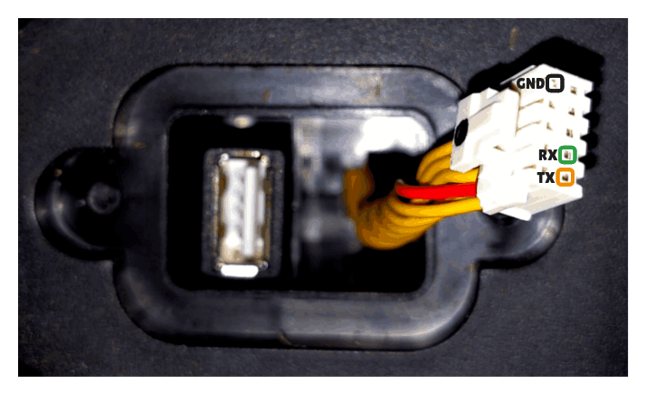

# Certificate Unpinning on Ecovacs Goat

> **⚠️ Disclaimer:**
>
> Accessing and modifying your `Ecovacs Goat` is **risky** and **may permanently damage** your device. These steps will void your warranty, may violate your terms of service, and Ecovacs will likely refuse support for modified devices. Proceed entirely at your own risk!
>
> > Double check all params. This instruction was tested on `Goat O500`. If you have another model, details may differ.

---

## 🟢 Simple Certificate Replacement

This method only updates certificate files on the device.  
No firmware unpacking or flashing is required.

### 1. Start UART Console (on host)

Connect to the Goat UART serial port.

> Adjust parameters as needed:
>
> - `/dev/ttyACM0`: device name may differ
> - `--log / --log-file`: optional, remove if you do not want logs

```sh
picocom /dev/ttyACM0 --flow n --baud 115200 --log ./b-capture-"$(date --iso-8601=seconds)".log

tio /dev/ttyACM0 --flow none -b 115200 --log --log-file ./b-capture-"$(date --iso-8601=seconds)".log
```

| UART - Goat O500 Panorama                                                         |
| :-------------------------------------------------------------------------------- |
| { width="300" } |

**Pinout (O500):**

| 1/6      | 2/7     | 3/8 | 4/9 | 5/10 |
| -------- | ------- | --- | --- | ---- |
| 5V (RED) | NC      | NC  | NC  | GND  |
| UART TX  | UART RX | NC  | NC  | NC   |

⚠️ **Never connect the 5V pin to your UART adapter.**

### 2. Interrupt Boot and Enter Hobot (on Goat)

During power-up, interrupt the boot process to enter `Hobot` (press any key).

??? note

    On some Goat you need to hit a specific key mentioned during the boot-up process like:
    ```
    Hit key to stop autoboot('CTRL+C'):  0
    ```

    Sometime `picocom` is not working and in that case you can try `minicom`. You can keep pressed your key (eg. `CTRL+C`) during the boot process until it's interropted.
    ```sh
    minicom -D /dev/ttyUSB0 -b 115200
    ```

### 3. Locate the eMMC and `userdata` Partition

Unlike older Ecovacs bots, Goat devices do **not** allow modifying `bootargs`
to drop into Linux.

All changes are performed from **U-Boot** by directly accessing the eMMC.

#### 3.1 Select eMMC Device

Device `0` is typically the internal eMMC.

```sh
# List all MMC devices
mmc list

# Select the device marked as eMMC (usually device 0)
mmc dev 0
```

Check write-protection status:

```sh
# Display eMMC details and write protection status
mmc info
```

Expected output:

```log
Boot area 0 is not write protected
```

#### 3.2 Identify `userdata` Partition

List partitions:

```sh
mmc part
```

On **Goat O500**, `userdata` is typically:

- **Partition 16** (hex `0x10` → `mmc 0:10`)

Verify filesystem access:

```sh
# List root directory of userdata partition
ext4ls mmc 0:10 /
```

You should see directories such as `/certs`.

#### 3.3 Verify Existing Certificate Location

Before writing anything, confirm that the existing certificate file
exists and is readable.

??? note

    If UART logging is enabled, the original certificate contents will also
    be captured in the UART log, which effectively serves as a backup.

```sh
# Load existing certificate into RAM
ext4load mmc 0:10 0xc2600000 /certs/master.pem

# Dump loaded content to verify correctness
md.b 0xc2600000 <FILE-SIZE-HEX>

# Optional: inspect full CA bundle
# ext4load mmc 0:10 0xc2600000 /certs/ca-certificates.crt
```

### 4. Replace Certificates (on Goat)

The replacement is done by:

1. Injecting the new certificate into RAM via UART
2. Writing it back into the `userdata` partition

#### 4.1 Prepare Host Environment (on host)

```sh
python3 -m venv .venv
source .venv/bin/activate
pip install pyserial
```

#### 4.2 Python UART Loader (on host)

This script:

- injects a PEM certificate into RAM at `0xC2600000`
- calculates the exact byte size
- prints the `ext4write` command for U-Boot

```py
import time
import serial

uart_port = "/dev/ttyACM0"   # CHANGE THIS
baud_rate = 115200
# userdata partition index (0x10 → mmc 0:10)
dev_part = 10

# Replace with your own PEM certificate
pem = """-----BEGIN CERTIFICATE-----
<YOUR CERTIFICATE HERE>
-----END CERTIFICATE-----"""

address = 0xC2600000
size = 0
commands = []
for line in pem.splitlines():
    for c in line:
        commands.append(f"mw.b {address:#010x} 0x{ord(c):02x} 1")
        address += 1
        size += 1
    commands.append(f"mw.b {address:#010x} 0x0a 1")
    address += 1
    size += 1

try:
    ser = serial.serial_for_url(
        uart_port,
        baud_rate,
        timeout=0.1,
        bytesize=8,
        parity="N",
        stopbits=1,
        rtscts=False,
        xonxoff=False,
        do_not_open=True,
    )
    ser.dtr = None
    ser.rts = None
    ser.exclusive = False
    ser.open()
    time.sleep(2)
    print(f"Connected to {uart_port} at {baud_rate} baud.")
    for cmd in commands:
        ser.write(cmd.encode("utf-8") + b"\n")
        ser.flush()
        print(f"Sent: {cmd}")
        time.sleep(0.01)
except serial.SerialException as e:
    print(f"UART error: {e}")
finally:
    if ser.is_open:
        ser.close()
        print("UART connection closed.")

print(f"\nTotal size (hex): 0x{size:x}")
print(f"Verify load: md.b 0xC2600000 0x{size:x}")
print(f"Write: ext4write mmc 0:{dev_part} 0xC2600000 /certs/master.pem 0x{size:x}")
```

#### 4.3 Write Certificate to eMMC (on Goat)

Execute the printed command in U-Boot:

```sh
# Write injected certificate from RAM into userdata
ext4write mmc 0:10 0xC2600000 /certs/master.pem <FILE-SIZE-HEX>
```

Verify write success:

```sh
# Reload certificate from eMMC
ext4load mmc 0:10 0xc2600000 /certs/master.pem
# Compare with injected content
md.b 0xc2600000 <FILE-SIZE-HEX>
```

### 5. Reboot

```sh
reset
```

The Goat now trusts your custom CA.

---

## 📝 Notes

- Always backup your data before making changes.
- Firmware updates or factory resets may overwrite certificates.
- For certificate creation, see [Create Certificates](../getting_started/certificates.md).
- For more context, see [Architecture](architecture.md) and [App Certificate Unpinning](certificate-unpinning-app.md).

## 📚 References

- <https://dontvacuum.me/talks/37c3-2023/37c3-vacuuming-and-mowing.pdf>
- <https://dontvacuum.me/talks/DEFCON32/DEFCON32_reveng_hacking_ecovacs_robots.pdf>
- <https://media.ccc.de/v/37c3-11943-sucking_dust_and_cutting_grass_reversing_robots_and_bypassing_security#t=2028>
- <https://github.com/itsjfx/ecovacs-hacking/blob/master/x1_omni.md>
- <https://dontvacuum.me/>
